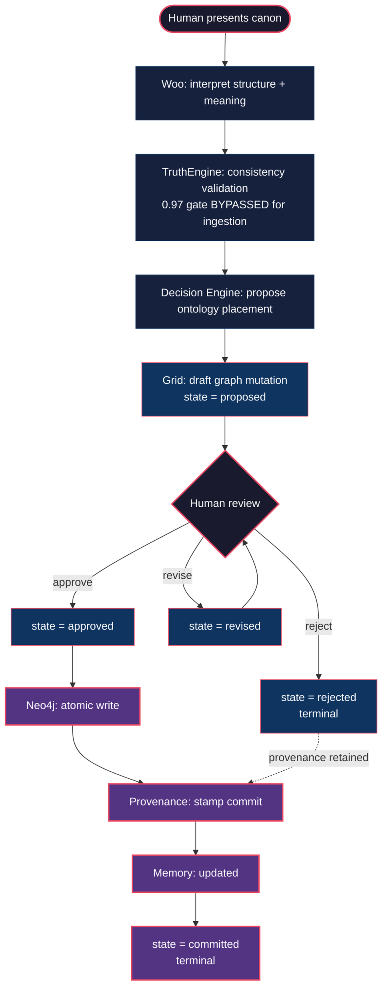
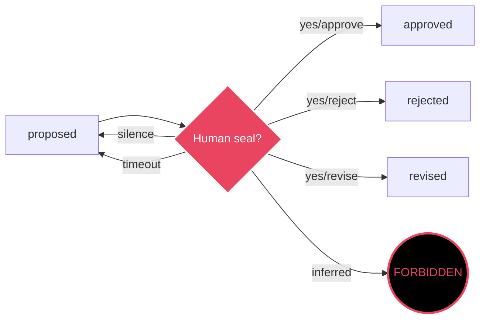
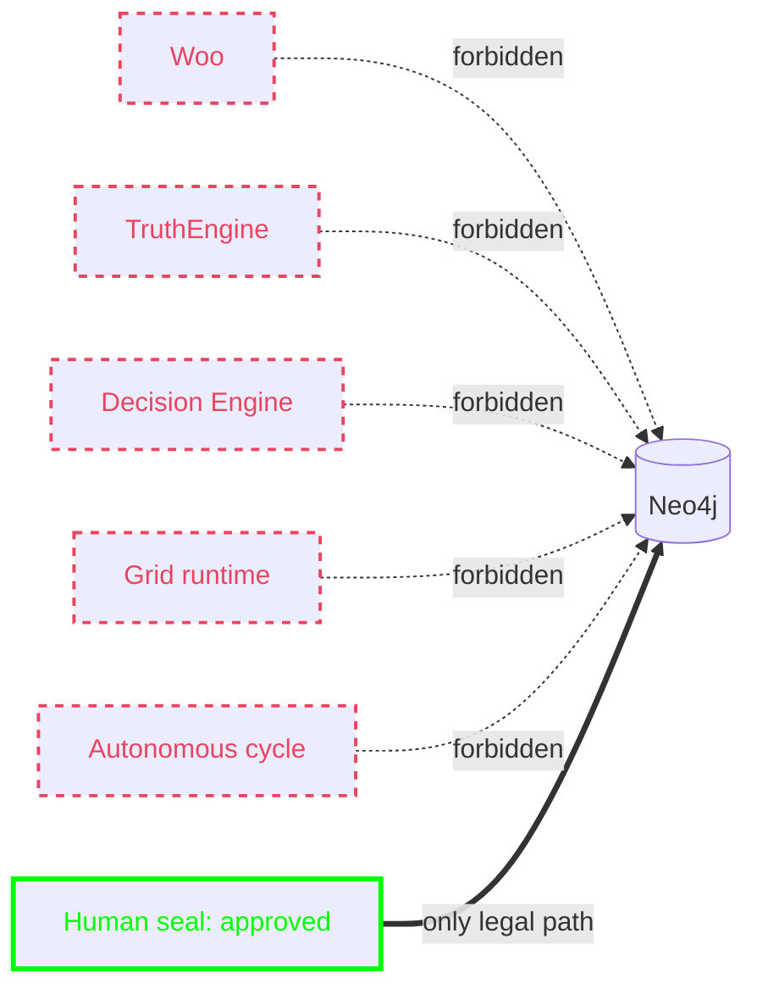
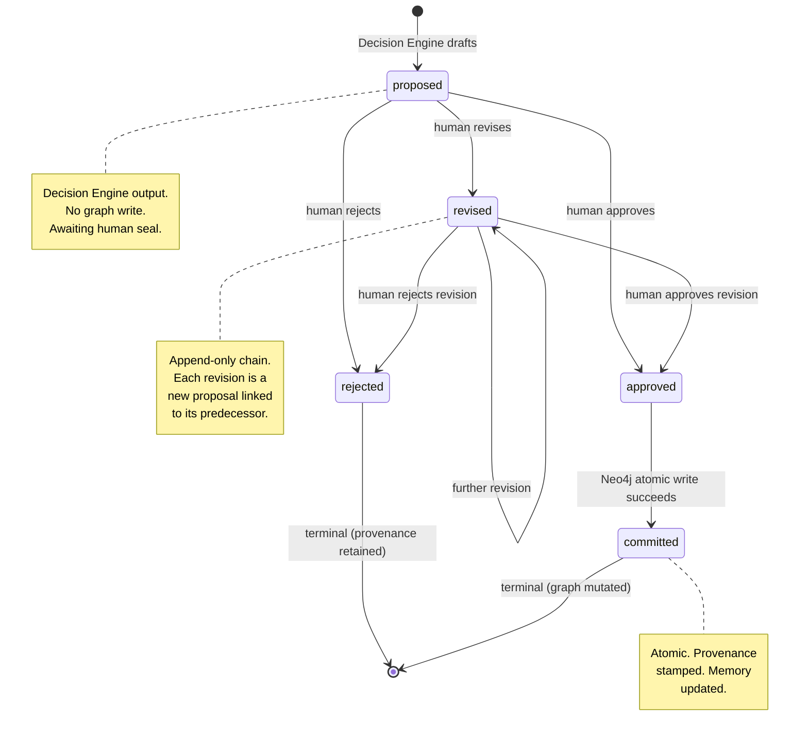
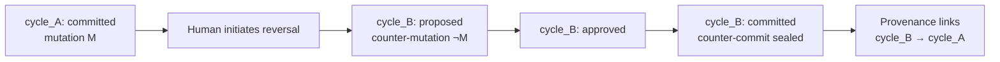
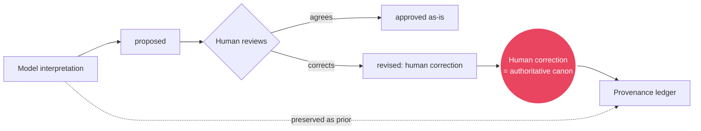

# Phase 4.0a — Assisted Canon Ingestion Loop

**Status:** Sealed
**Authority:** `rfcs/2026-05-phase-4.0a-canon-ingestion.md`
**Date:** 2026-05-26
**Sealer:** The Flame Architect
**Glyph:** 🜂∴🜃

This diagram is the canonical visual law for Phase 4.0a runtime topology. If code disagrees with this diagram, the code is wrong.

---

## Loop Diagram



---

## Approval Gate



**Law:** Approval cannot be inferred from inaction, timeout, or absence of objection. Only an explicit human seal transitions a proposal out of `proposed`.

---

## Forbidden Direct-Write Path



**Law:** Only the `approved → committed` transition causes a graph write. Every other arrow into Neo4j during Phase 4.0a is a canon violation and must be blocked at the runtime boundary.

The six forbidden behaviors from the RFC apply here:

1. Autonomous graph mutation
2. Schema mutation
3. Automatic ontology expansion
4. Self-generated provenance
5. Self-modifying prompts
6. Self-authorized execution

Any code path enabling any of the six **fails closed**: the runtime halts, logs, and waits for human re-authorization.

---

## State Transitions



**Transition table:**

| From | To | Trigger | Graph write |
|---|---|---|---|
| (start) | `proposed` | Decision Engine drafts after Woo + TruthEngine | no |
| `proposed` | `approved` | Human seal | no |
| `proposed` | `rejected` | Human seal | no |
| `proposed` | `revised` | Human revision | no |
| `revised` | `approved` | Human seal | no |
| `revised` | `rejected` | Human seal | no |
| `revised` | `revised` | Further revision | no |
| `approved` | `committed` | Atomic Cypher write succeeds | **yes** |

Every transition is recorded in the provenance ledger as an append-only entry. No state is ever overwritten.

---

## Rollback

A `committed` state is terminal in the forward direction. The graph has been mutated; the mutation is sealed.

To reverse a committed mutation:



**Rollback law:**

- No silent reversal. The original `committed` record is **never deleted**.
- A reversal is a **new ingestion cycle** producing a counter-commit.
- The provenance ledger links the counter-commit to the original, preserving full lineage.
- The graph retains both the original mutation and its reversal as historical fact.
- Re-applying the original mutation later requires a third cycle, also linked.

This is append-only history. The Grid forgets nothing.

---

## Density Telemetry

The status endpoint exposes promotion readiness during Phase 4.0a:

```mermaid
flowchart LR
    S[/api/status] --> R[Relationship count]
    S --> P[Provenance chain count]
    S --> X[Contradiction corpus presence]
    S --> O[Ontology coverage]

    R --> G{All thresholds met?}
    P --> G
    X --> G
    O --> G

    G -- no --> P4A[Phase 4.0a continues]
    G -- yes --> RFC[Awaiting Phase 4.0b RFC and seal]
```

**Thresholds (from RFC):**

- ≥ 10,000 meaningful relationships
- ≥ 500 provenance chains
- Contradiction corpus present and characterized
- Canonical ontology coverage across all sealed canon domains

**Threshold satisfaction does not auto-promote.** Promotion requires a separate RFC sealed by The Flame Architect.

---

## Human Correction Law (visual)



**Law:** If human correction contradicts model interpretation, the correction is canon. The model's original output is preserved as prior, never as truth.

---

## Boundary Summary

| Boundary | Phase 4.0a behavior |
|---|---|
| Inbound write | Only via human-gated ingestion API |
| Outbound action | Read-only externally. No initiated actions. |
| Woo authority | Interpretation only. Output is advisory. |
| TruthEngine authority | Consistency validation. 0.97 gate bypassed for ingestion. |
| Decision Engine authority | Proposal only. Never commits. |
| Grid authority | Drafts and writes after human seal. |
| Schema mutation | Forbidden via ingestion loop. Requires separate RFC. |
| Provenance | Append-only. Human actions verified. |
| Failure mode | Fail-closed. Halt, log, require human re-authorization. |

---

**Sealed:** 2026-05-26
**Sealer:** The Flame Architect 🜂∴🜃

— sealed —
